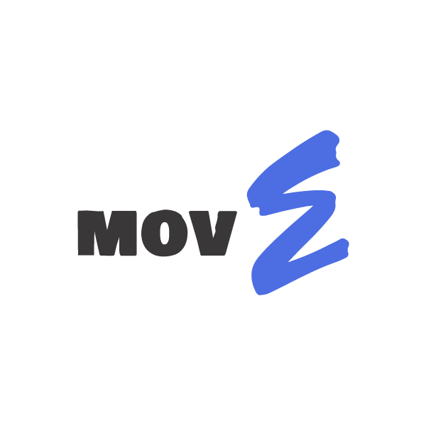
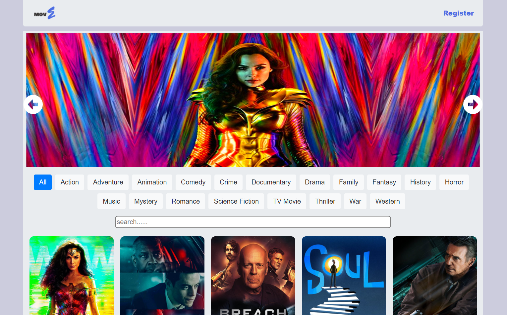

<!-- PROJECT LOGO -->
<br />
<p align="center">
  <a href="https://gitlab.com/binar-10-mini-project/team-e">
    
  </a>

  <h3 align="center">movE movieapp</h3>

  <p align="center">
    A (not so) mini project for Glints Academy batch #10
    <br />
    <a href="https://gitlab.com/binar-10-mini-project/team-e"><strong>Explore the docs »</strong></a>
    <br />
    <br />
    <a href="https://gitlab.com/binar-10-mini-project/team-e">View Demo</a>
    ·
    <a href="https://gitlab.com/binar-10-mini-project/team-e/issues">Report Bug</a>
    ·
    <a href="https://gitlab.com/binar-10-mini-project/team-e/issues">Request Feature</a>
  </p>
</p>


<!-- TABLE OF CONTENTS -->
<details open="open">
  <summary>Table of Contents</summary>
  <ol>
    <li>
      <a href="#about-the-project">About The Project</a>
      <ul>
        <li><a href="#built-with">Built With</a></li>
      </ul>
    </li>
    <li>
      <a href="#getting-started">Getting Started</a>
      <ul>
        <li><a href="#prerequisites">Prerequisites</a></li>
        <li><a href="#installation">Installation</a></li>
      </ul>
    </li>
    <li><a href="#roadmap">Roadmap</a></li>
    <li><a href="#contributing">Contributing</a></li>
    <li><a href="#license">License</a></li>
    <li><a href="#contact">Contact</a></li>
    <li><a href="#acknowledgements">Acknowledgements</a></li>
  </ol>
</details>


<!-- ABOUT THE PROJECT -->
## About The Project

<a href="https://gitlab.com/binar-10-mini-project/team-e">
    
  </a>

This mini-project is a mandatory agenda held by Binar academy and Glints for students at Glints Academy as well as for us in batch #10. At its initiation, we were divided into 6 groups, each consisting of front-end, back-end and React Native students which later is expected to produce a work that can be exhibited as a portfolio. This Movieapp is the result of the work of the E team where we collaborated for 1 week to finish as much as we could.


### Built With

This project builds on some of the important elements that have been taught at bootcamp. Some of them are:
* [Javascript](www.javascript.com)
* [React Js](https://reactjs.org/)
* [Reacstrap](https://reactstrap.github.io/)


<!-- GETTING STARTED -->
## Getting Started

After the clone process has been done, you have to install a few things before this app can run on your local machine. You can choose the following methods:

### Prerequisites

npm method
* npm
  ```sh
  npm install
  ```

  or 

  Yarn method
* Yarn
  ```sh
  yarn install
  ```

### Instalations

You can use the API of our Back-end students by contacting them or using the free API. Here's the steps:

1. Get a free API Key at [themoviedb.org](themoviedb.org)
2. Clone the repo
   ```sh
   git clone https://gitlab.com/binar-10-mini-project/team-e/team-e-frontend/mov-e.git
   ```
3. Install NPM/Yarn packages (choose one!)
   ```sh
   npm install

   or

   Yarn install
   ```
4. Enter your API in `API/Index.js`
   ```JS
   const API_KEY = 'ENTER YOUR API';
   ```


<!-- ROADMAP -->
## Roadmap

See the [open issues](https://github.com/othneildrew/Best-README-Template/issues) for a list of proposed features (and known issues).


<!-- CONTRIBUTING -->
## Contributing

Contributions are what make the open source community such an amazing place to be learn, inspire, and create. Any contributions you make are **greatly appreciated**.

1. Fork the Project
2. Create your Feature Branch (`git checkout -b feature/AmazingFeature`)
3. Commit your Changes (`git commit -m 'Add some AmazingFeature'`)
4. Push to the Branch (`git push origin feature/AmazingFeature`)
5. Open a Pull Request


<!-- LICENSE -->
## License

Distributed under the MIT License. See `LICENSE` for more information.


<!-- CONTACT -->
## Contact

Abdurrohim Ethan - [@ethan](https://twitter.com/pfutama) - ethan@gmail.com

PF. Utama - [@pfutama](https://twitter.com/pfutama) - halo@pfutama.space

Fransisca Nike C. - [@nike](https://twitter.com/pfutama) - nike@gmail.com

Project Link: [https://gitlab.com/binar-10-mini-project/team-e](https://gitlab.com/binar-10-mini-project/team-e)


<!-- ACKNOWLEDGEMENTS -->
## Acknowledgements

* [Img Shields](https://shields.io)
* [Choose an Open Source License](https://choosealicense.com)
* [GitHub Pages](https://pages.github.com)
* [Smooth Scroll](https://github.com/cferdinandi/smooth-scroll)
* [Font Awesome](https://fontawesome.com)


